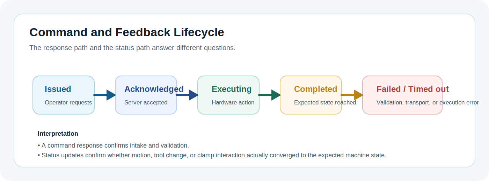

# Architecture

## System overview

`rimokun` is the control application for a gantry-style remote manipulator used in the J-PARC remote-ready primary beamline upgrade. The software is organized around the needs of remote handling: operators issue motion or tooling actions from the GUI, the server coordinates execution against the machine and connected subsystems, and live feedback returns to the GUI so the operator can confirm actual machine state.

The main runtime model is:

1. `rimoServer` starts and initializes the manipulator-facing subsystems.
2. The server exposes command and status interfaces.
3. `rimokunControl` connects as the operator client.
4. Operators issue commands through the GUI.
5. The server executes or rejects those commands and publishes current state.

This separation is deliberate. In a remote handling environment, the control path must be centralized and the feedback path must remain authoritative.

  
  
The GUI is the operator surface, the server is the execution authority, and the hardware-facing layer provides the feedback needed to confirm motion, tool changes, and clamp state.

## Major components

### GUI layer

The GUI executable is `rimokunControl`. It is the operator-facing control station for:

- observing manipulator state
- issuing motion-related commands
- controlling tool changer actions
- monitoring subsystem health and safety-related indications

The GUI does not own the machine state. It presents the state published by the server and sends operator requests for execution.

### Server layer

The server executable is `rimoServer`. It coordinates:

- command intake and validation
- machine lifecycle
- interaction with motor control, control panel, and I/O subsystems
- aggregation of status into a single machine view
- publication of operator-visible state

The `Machine` runtime is the central coordination point in the current codebase.

### Hardware-facing layer

Below the server, the software interfaces with the manipulator hardware and related subsystems. Based on the repository structure and configuration, this includes responsibilities such as:

- gantry and axis motion control
- digital I/O interaction
- control panel communication
- tool changer actuation
- vacuum clamp-related signal handling
- sensor and safety signal monitoring

The exact field-level hardware contract should be documented separately when the deployment-specific interface is formally published.

## Functional relationship between GUI, server, and hardware

The control boundary is:

- operators interact with the GUI
- the GUI sends requested actions to the server
- the server decides whether and how those actions are executed
- the hardware-facing subsystems produce feedback
- the server converts that feedback into published system state
- the GUI renders that state back to the operator

This keeps machine authority in the server and prevents the GUI from becoming a second source of truth.

## Command flow

The command path is operator-driven and server-mediated:

1. An operator selects an action in the GUI.
2. The GUI creates a command representing that request.
3. The command is sent to the server through the command interface.
4. The server validates the request against expected structure and allowed values.
5. The server dispatches the request to the relevant machine or subsystem logic.
6. The server returns an acknowledgement or error response to the GUI.
7. Ongoing state changes are reflected through subsequent status updates.

Typical command categories for this system include:

- manipulator motion or positioning actions
- tool changer actions
- subsystem reset or recovery actions
- maintenance or diagnostic commands

Interface structure and lifecycle expectations are covered in [Interfaces](interfaces.md).

  
  
A response that says a command was accepted does not by itself prove that the manipulator reached the requested state. Completion is confirmed through subsequent status updates and subsystem feedback.

## Status flow

The status path is hardware-informed feedback:

1. Hardware and subsystem state is read or derived inside the server runtime.
2. The server builds a unified machine status snapshot.
3. That status is published to connected clients.
4. The GUI updates its operator-visible state from the published snapshot.

For a remote manipulator, this feedback path is as important as the command path. Operators need confirmation of:

- current position or motion state
- tool changer condition
- vacuum clamp-related state
- subsystem health
- safety or fault indications

## Deterministic behavior and operator feedback

This system is used in a context where delayed, missing, or ambiguous feedback can lead to unsafe or inefficient operation. The architecture therefore needs to support:

- predictable command handling
- ordered execution inside the server
- clear distinction between acceptance and completion
- rapid visibility of subsystem faults or stale data

That does not mean every subsystem is hard real-time. It does mean the software should behave deterministically enough that operators and engineers can reason about what the manipulator is doing and why.

## Safety considerations

Remote handling imposes constraints that should shape both software design and operations:

- operators may not have direct visual or physical confirmation beyond the provided feedback channels
- motion, tool change, and clamp interaction all depend on reliable state awareness
- command execution should prefer safe rejection over ambiguous behavior
- faulted or stale state should be visible quickly enough to support safe intervention

This documentation does not define a full safety case. It does document where the software relies on command validation, state publication, and explicit operational procedures.

## Deployment and communication model

The current repository shows a local IPC-based default configuration for GUI/server communication. `Config/rimokun.yaml` defines command and status addresses under `RimoServer` and `RimoClient`, with defaults such as:

- status address: `ipc:///tmp/rimoStatus`
- command address: `ipc:///tmp/rimoCommand`

That indicates a same-host control station model as the current baseline. If production deployment uses a different topology, document that explicitly when finalized.

## Practical reading path

Use this page together with:

- [Interfaces](interfaces.md) to understand how command and status channels separate acknowledgement from completion
- [Server](server.md) to see where ordering, validation, and state aggregation live
- [GUI](gui.md) to understand how operators consume the feedback path

## Related pages

- [Interfaces](interfaces.md) for command and status behavior
- [GUI](gui.md) for operator workflows
- [Server](server.md) for runtime coordination responsibilities
- [Operation](operation.md) for bring-up and shutdown guidance
