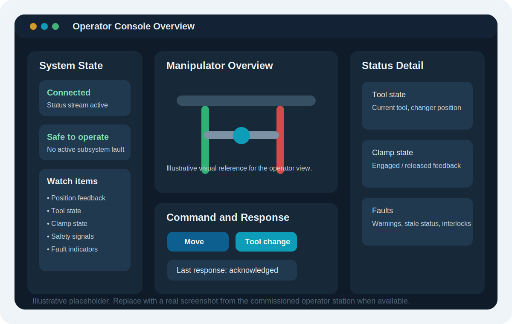
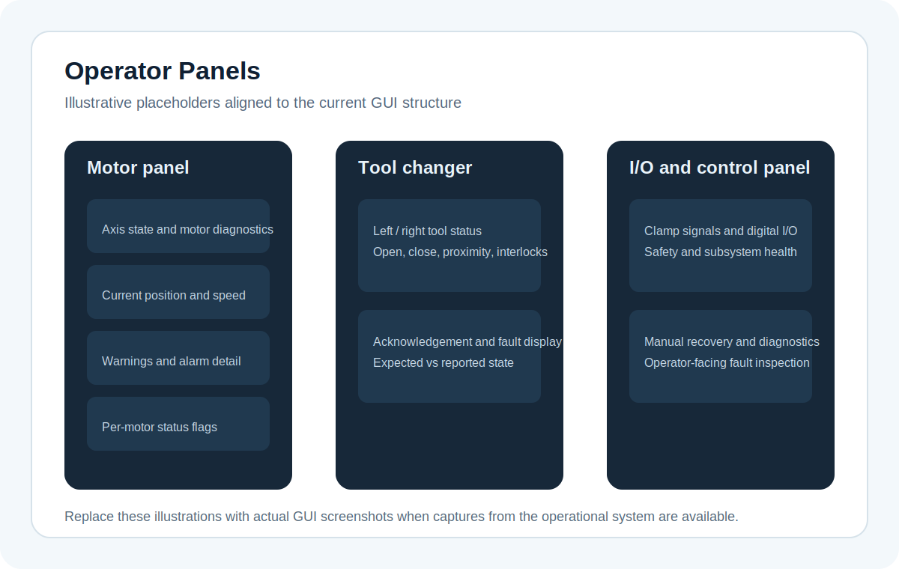

# GUI

## Purpose of the GUI

`rimokunControl` is the operator console for the gantry-style remote manipulator. Operators use it to issue motion and tooling actions, observe current machine state, and detect when the manipulator or associated subsystems are no longer behaving as expected.

The GUI depends on the server for command execution and status publication.

## Visual reference

  

    
    
Illustrative operator-console placeholder based on the current GUI structure. Replace with a real screenshot from the deployed control station when available.

  

  

    
    
Illustrative panel overview showing the kinds of screens the operator uses for motion, tooling, and subsystem inspection. Replace with actual captures during commissioning.

  

## What operators do in the GUI

Operators use the GUI to:

- confirm the system is connected and publishing live status
- observe current manipulator position and subsystem state
- issue motion, tool change, or recovery commands
- monitor tool and clamp-related feedback after each action
- respond to communication, subsystem, or fault indications

## Operator workflow
1. Confirm readiness:
Before commanding the manipulator, confirm:

- the server connection is active
- status is updating
- subsystem health indicators are credible
- the machine is in the expected starting state

2. Issue a command:
Select an action such as:

- a manipulator movement
- a tool changer action
- a subsystem reset or recovery action

The GUI sends the request to the server and waits for a response.

3. Watch feedback:
After a command is accepted, watch:

- position or motion-related state
- tool state
- clamp-related state
- warning or fault indicators

Use the GUI to confirm real state changes, not just command submission.

4. Respond to errors:
If the GUI reports a timeout, connection problem, or unexpected status:

- stop issuing additional commands
- determine whether the problem is transport, execution, or feedback related
- move to the recovery guidance in [Troubleshooting](troubleshooting.md)

## Main responsibilities

The GUI is responsible for:

- presenting the main operator window
- showing machine and subsystem state
- collecting operator input
- sending commands to the server
- reacting to responses and connection problems
- updating local view state from streamed status messages

## Main screens

The current source tree suggests these main screens:

- the main control window
- joystick-related interaction
- motor panels and motor statistics
- tool changer controls
- Contec-related views

These map to three practical views:

- server reachable vs. server unreachable
- command accepted vs. command completed
- live status vs. stale status
- subsystem fault vs. user-input error

## Feedback model

The GUI shows two kinds of feedback:

- command responses that indicate whether the server accepted or rejected a request
- status updates that show the current machine state

Use both together. A successful response does not by itself confirm motion completion, tool change success, or clamp engagement.

## Related pages

- [Interfaces](interfaces.md) for command and status behavior
- [Operation](operation.md) for the normal operating sequence
- [Troubleshooting](troubleshooting.md) for operator-visible failure scenarios
- [Architecture](architecture.md) for the full control and feedback path
- [Class Reference](classes.md) for GUI classes such as `MainWindow`, `Updater`, and `GuiStateStore`
