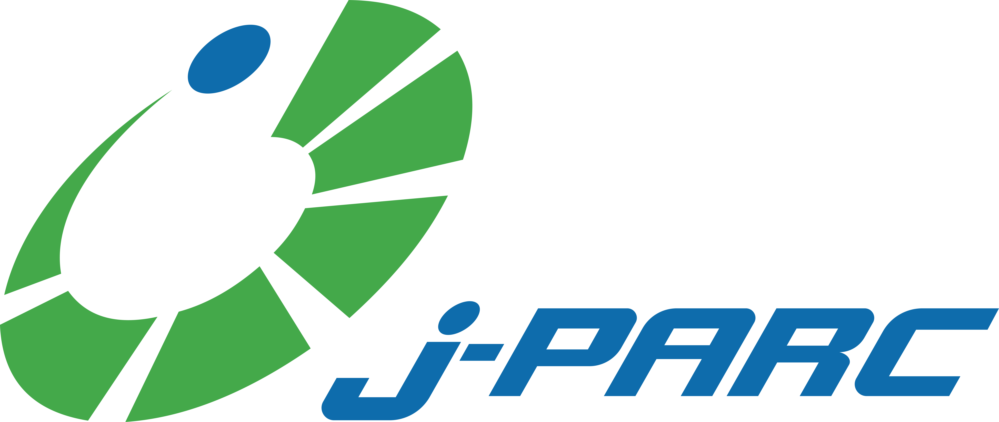
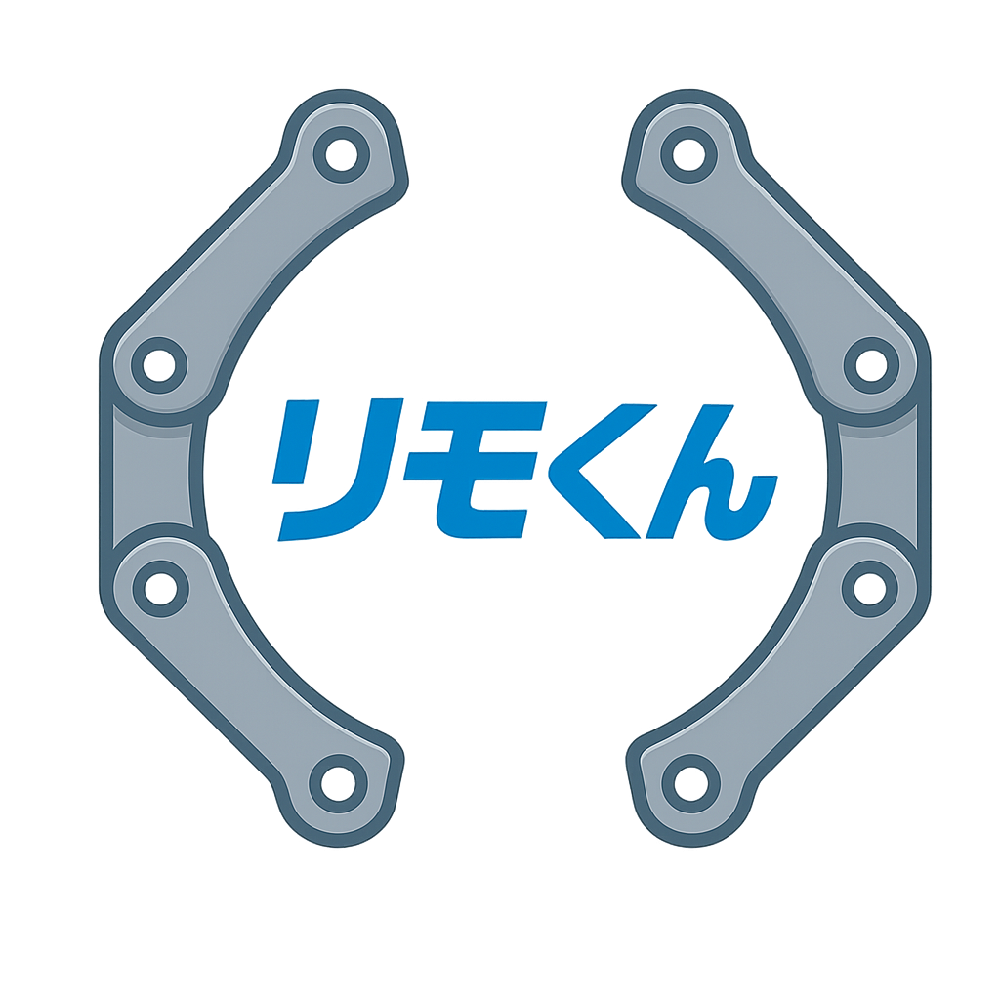
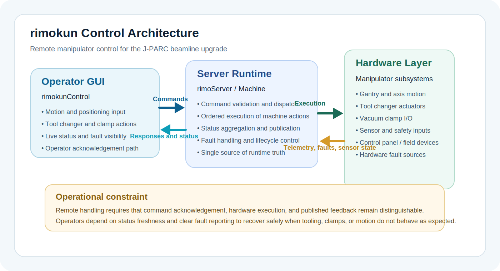

  <h1>rimokun Documentation</h1>
  
<strong>Remote manipulator control for the J-PARC remote-ready primary beamline upgrade.</strong>

  
`rimokun` controls a gantry-style remote handling system with a GUI, a server backend, and command/status links between them. It is built for motion control, tool changing, vacuum clamp work, and feedback-driven operation in constrained environments.

  

    J-PARC beamline upgrade
    Remote handling
    GUI + server architecture
    Command and status feedback
  

  

    <a class="primary" href="quickstart.md">Open quickstart</a>
    <a class="secondary" href="architecture.md">Study architecture</a>
    <a class="secondary" href="operation.md">Review operation</a>
  

  

    
    
    
  

## Mission profile

The system is used to coordinate:

- gantry motion and positioning
- tool changing associated with vacuum clamp tooling
- vacuum clamp interaction and related I/O
- sensor, safety, and subsystem state monitoring
- operator feedback through a live control station

  
<strong>Operators</strong>Run the manipulator from the GUI and verify state.

  
<strong>Engineers</strong>Commission, maintain, and troubleshoot the system.

  
<strong>Developers</strong>Work on the GUI, server, transport, and tests.

## System overview

  
  
The system is built around a single authoritative server runtime. Operators act through the GUI, while hardware feedback flows back through the server so that published status reflects actual runtime state rather than optimistic UI assumptions.

## Main sections

  

    <h3>Architecture</h3>
    
How the GUI, server, and hardware-facing subsystems fit together.

  

  

    <h3>Interfaces</h3>
    
How commands and status move between GUI and server.

  

  

    <h3>Operation</h3>
    
How to start, use, and stop the system safely.

  

  

    <h3>Troubleshooting</h3>
    
Where to look when commands, status, tools, or clamps do not behave correctly.

  

  

    <h3>Class Reference</h3>
    
A short guide to the main GUI and server classes in the codebase.

  

## Start here

- [Installation](installation.md) for prerequisites and local setup
- [Quickstart](quickstart.md) for the fastest path to a running GUI and server
- [Architecture](architecture.md) for the control model
- [Operation](operation.md) for bring-up, tool changes, clamp interaction, and shutdown
- [Class Reference](classes.md) for key source-level classes

  <strong>Note:</strong> some deployment-specific details are still placeholders, including any formal external protocol publication and production service topology. Those gaps are marked explicitly rather than filled with guessed behavior.

